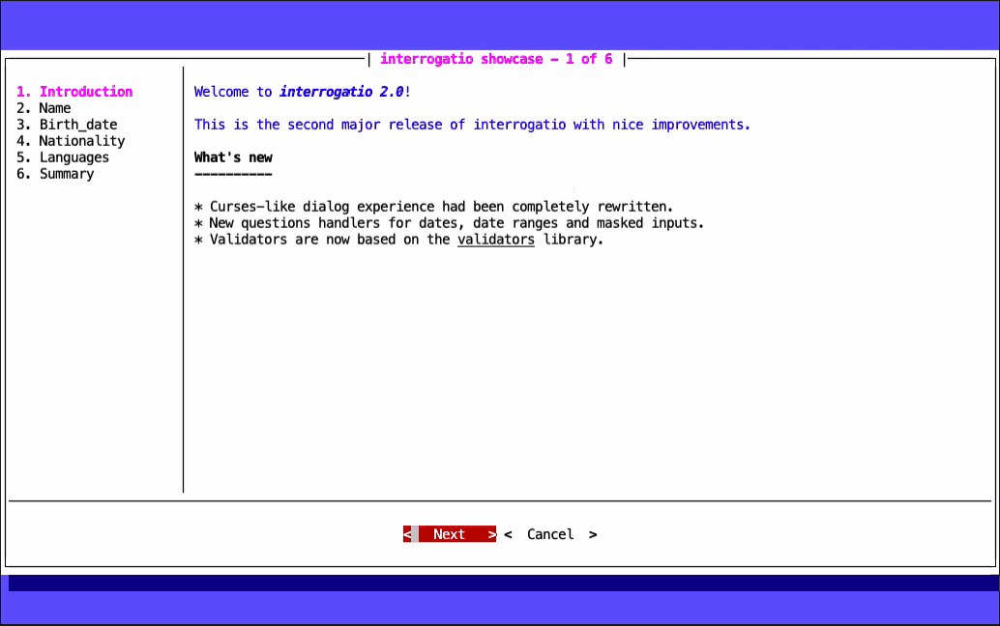
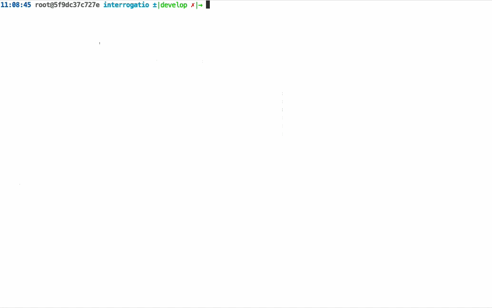

# interrogatio

 [](https://pypi.org/project/interrogatio/)  [](https://github.com/ffaraone/interrogatio/actions) [](https://codecov.io/gh/ffaraone/interrogatio)


A python library to prompt users for inputs in a terminal application.


## What is interrogatio

`interrogatio` is a python 3.8+ library based on the [python-prompt-toolkit](https://github.com/prompt-toolkit/python-prompt-toolkit) and inspired by [PyInquirer](https://github.com/CITGuru/PyInquirer/) that help CLI developers to ask users for inputs.

Questions can be rendered onto the terminal prompt or as curses-like dialogs.


## Documentation

[`interrogatio` documentation](https://interrogatio.readthedocs.io/en/latest/) is hosted on _Read the Docs_.


## Getting started


### Requirements

`interrogatio` depends on the python-prompt-toolkit library and its dependencies.

### Installation


#### Using pip


```
$ pip install interrogatio
```


#### Extra dependencies

If you want to use the shell command with yml files you can install the yml dependency:

```
$ pip install interrogatio[yml]
```


### Basic usage

`interrogatio` needs a list of questions to prompt the user for answers.

Each question is a python dictionary with at least the following keys:

* **name**: it has to be unique within the list of questions. It represents the variable name;
* **type**: the type of question;
* **message**: the text of the prompt.

Optionally you should specify:
    
* a **default**: a default value;
* a **validators**: a list of children of Validator class
* a **values**: a list of tuples (value, label) to provide a list of choices 
    for the ``selectone`` or ``selectmany`` question types.


`interrogatio` can run into two modes: dialog and prompt.

#### Dialog mode



```
from interrogatio import dialogus

questions = [
    {
        'name': 'name',
        'type': 'input',
        'message': "What's your name ?",
        'description': 'Please enter your full name. This field is required.',
        'validators': [{'name': 'required'}],
    },
    {
        'name': 'birth_date',
        'type': 'date',
        'message': "What's your birth date ?",
        'description': 'Enter your birth date.',
    },
    {
        'name': 'nationality',
        'type': 'selectone',
        'message': "What's your nationality ?",
        'description': 'Please choose one from the list.',
        'validators': [{'name': 'required'}],
        'values': [
            ('IT', 'Italian'),
            ('ES', 'Spanish'),
            ('US', 'American'),
            ('UK', 'English'),
        ],
    },
    {
        'name': 'languages',
        'type': 'selectmany',
        'message': "What are your favorite programming languages ?",
        'description': 'Please choose your favorites from the list.',
        'values': [
            ('py', 'Python'),
            ('rb', 'Ruby'),
            ('js', 'Javascript'),
            ('go', 'Golang'),
            ('rs', 'Rust'),
            ('c', 'C'),
            ('cpp', 'C++'),
            ('java', 'Java'),
        ],
    },
]

intro = """<blue>Welcome to <b><i>interrogatio 2.0</i></b>!

This is the second major release of interrogatio with nice improvements.</blue>

<b>What's new</b>
<b>----------</b>

* Curses-like dialog experience had been completely rewritten.
* New questions handlers for dates, date ranges and masked inputs.
* Validators are now based on the <u>validators</u> library.
"""


answers = dialogus(questions, 'interrogatio showcase', intro=intro, summary=True)
```

#### Prompt mode



```
from interrogatio import interrogatio

questions = [
    {
        'name': 'name',
        'type': 'input',
        'message': "What's your name ?",
        'description': 'Please enter your full name. This field is required.',
        'validators': [{'name': 'required'}],
    },
    {
        'name': 'birth_date',
        'type': 'date',
        'message': "What's your birth date ?",
        'description': 'Enter your birth date.',
    },
    {
        'name': 'nationality',
        'type': 'selectone',
        'message': "What's your nationality ?",
        'description': 'Please choose one from the list.',
        'validators': [{'name': 'required'}],
        'values': [
            ('IT', 'Italian'),
            ('ES', 'Spanish'),
            ('US', 'American'),
            ('UK', 'English'),
        ],
    },
    {
        'name': 'languages',
        'type': 'selectmany',
        'message': "What are your favorite programming languages ?",
        'description': 'Please choose your favorites from the list.',
        'values': [
            ('py', 'Python'),
            ('rb', 'Ruby'),
            ('js', 'Javascript'),
            ('go', 'Golang'),
            ('rs', 'Rust'),
            ('c', 'C'),
            ('cpp', 'C++'),
            ('java', 'Java'),
        ],
    },
]


answers = interrogatio(questions)
```

### Contributing

If you want to contribute to the project, you can submit bugs, feature requests or fork the github repository and submit your pull request.


### License

`interrogatio` is released under the [BSD 3-Clause "New" or "Revised" License](https://opensource.org/licenses/BSD-3-Clause>).
